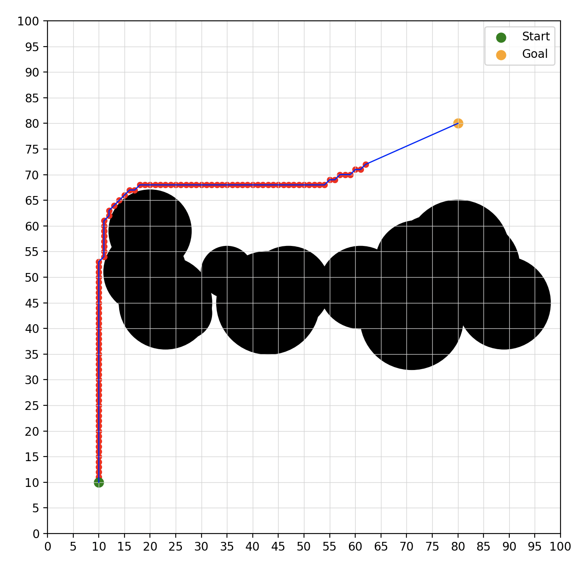
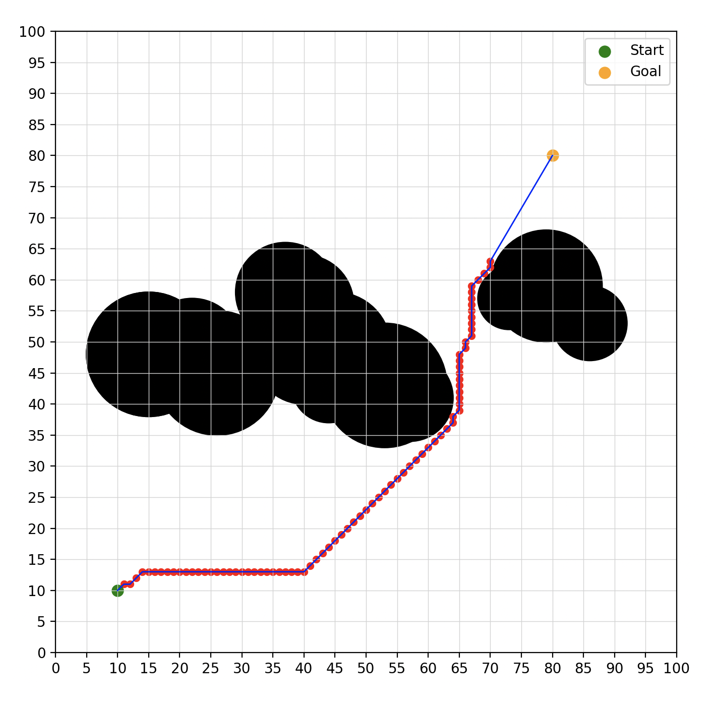
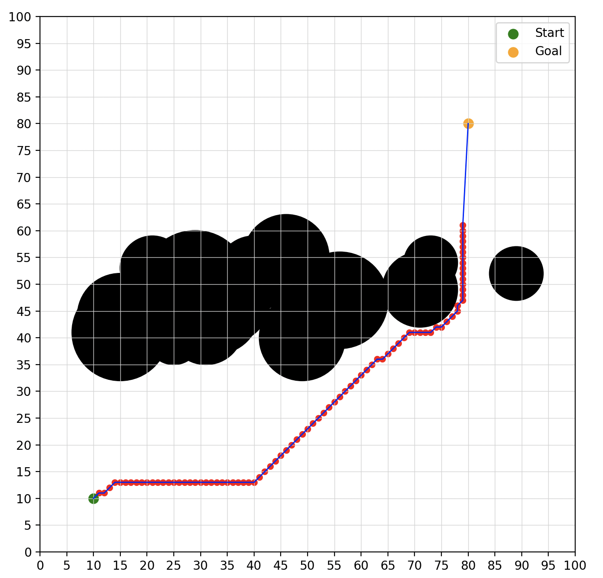

RP Implementation #7

Implemented the research paper titled "An Improved A* Algorithm for UAV Path Planning Problems."

This paper improves A* only minimally, they change the way neightbors are selected.

Some examples of the improved A-star:

