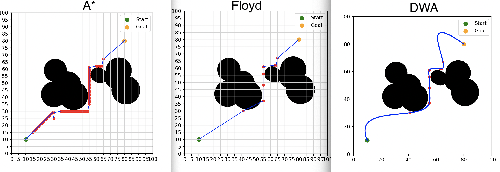
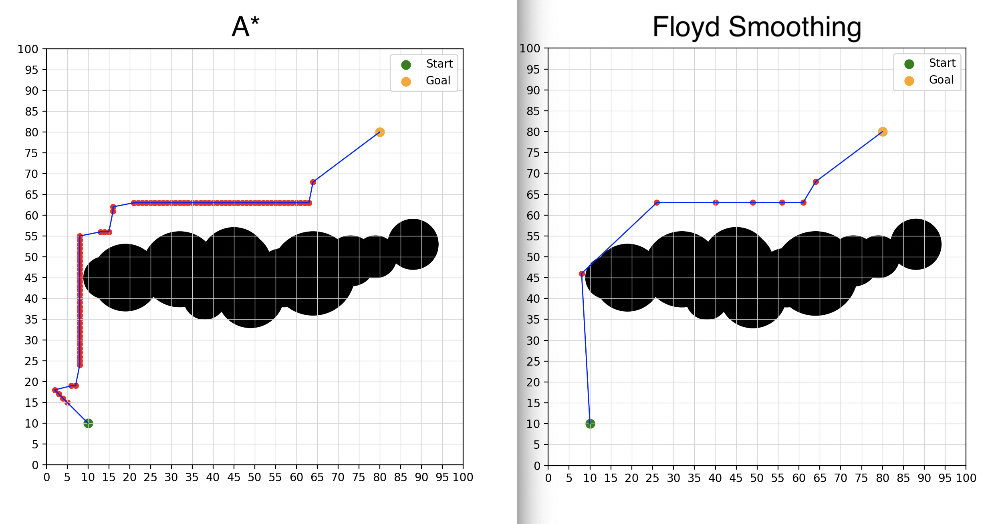
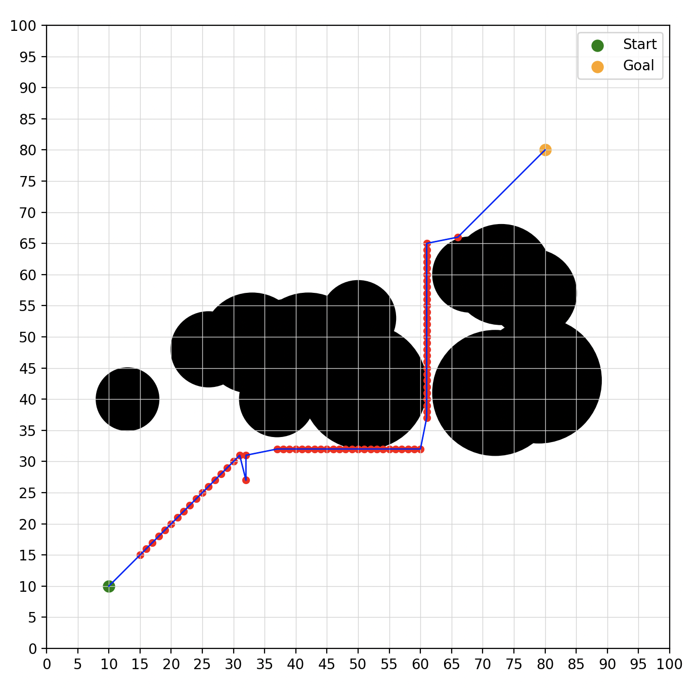
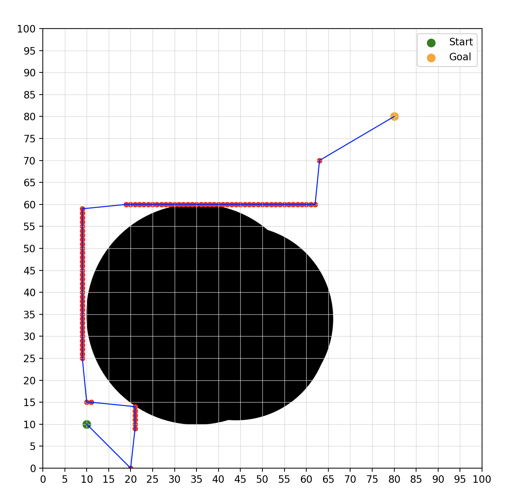
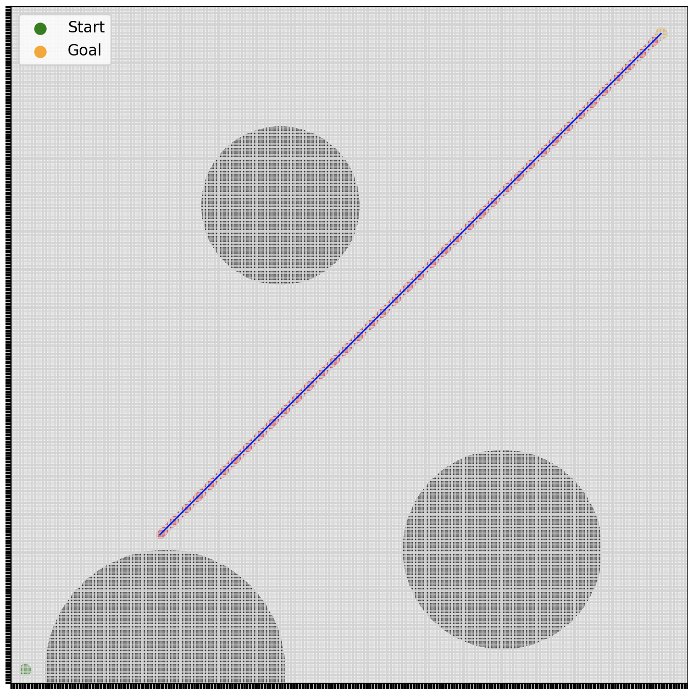

RP Implementation #6

Implemented the research paper titled "UAV Path Planning Based on Improved A∗and DWA Algorithms."

This paper combines global A* and the Dynamic Window Approach (DWA). A desired path is first found using A*. Then, using Floyd's algorithm, redundant nodes are removed from the path. Finally, DWA is used to turn the path into a one fliable by the UAV according to it's parameters. Over all, the proposed method is a useful algorithm. 

The final result:

Some examples of the A-star:

The first (failed) iteration:

