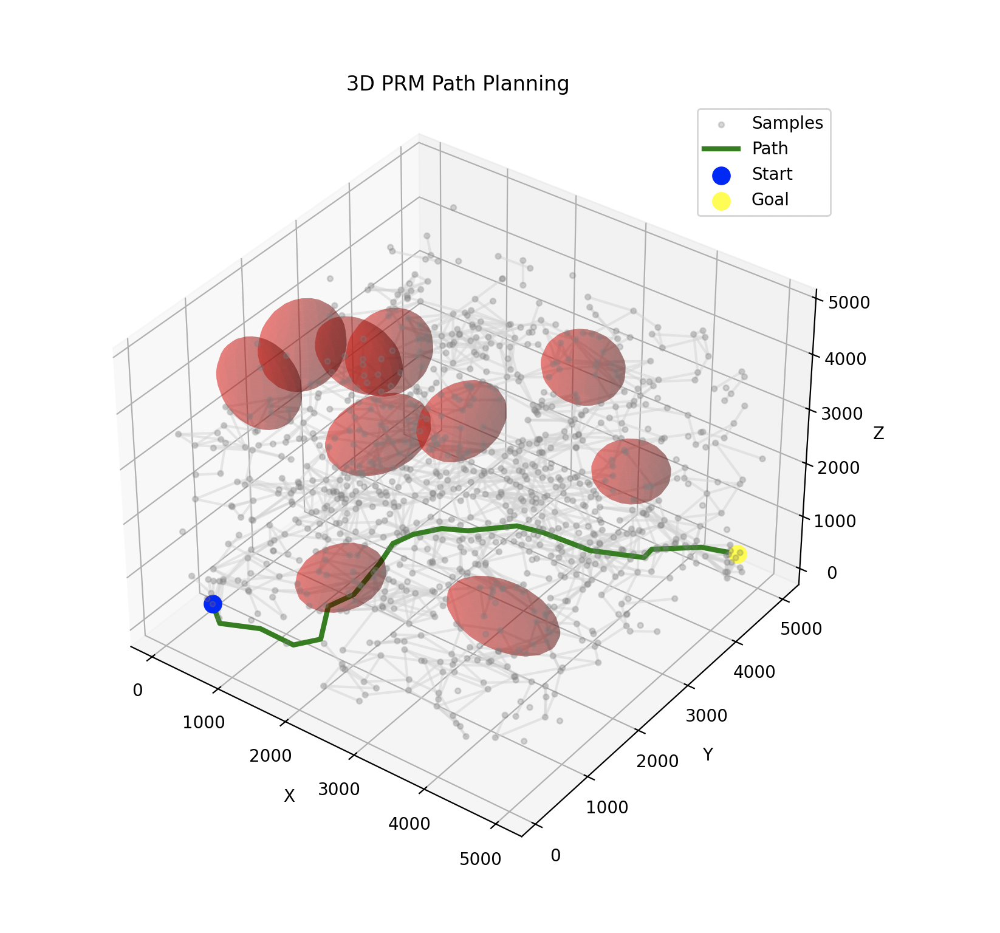
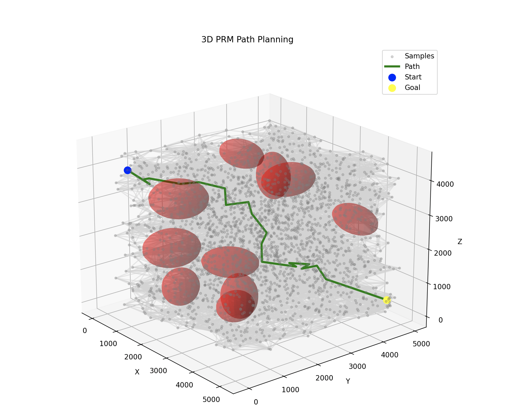

RP Implementation #1

Implemented the research paper titled "AI-based Air-to-Surface Mission Planning using Predictive Launch Acceptability Region Approach." I used boost for dijkstra's algorithm and https://github.com/AndrewWalker/Dubins-Curves to calculate trajectory segments. ChatGPTed the python. It's been a while since I worked with C++ and coding in general so the code here is sloppy. However, getting the implementation (only works sometimes) done feels like a huge win none the less.

Here are some pictures:

