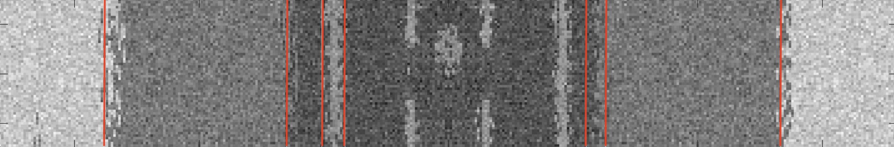

RP Implementation #2

Implemented the research paper titled "Machine Learning Based Radar Cross-Section Clustering Towards Enhanced Situational Awareness for Next-Generation Fighter Aircraft." Kinda works kinda doesn't. Langer # of cycles cause lines to continue drifting in a direction. Since how to place the hyperlines wasn't specifed I attempted to implement a way to automatically place the correct amount. I thought I would use blurring to help place the lines but didn't have time to complete this feature only added blur. Also next time I should try to add such features once the idea in the paper is implemented and note before.

Here are some pictures:

Initial

After Algo

Blur feature

