RP Implementation #4

Implemented the research paper titled "Path planning for unmanned aerial vehicles in complex environment based on an improved continuous ant colony optimisation."

Implemented this again. Works much better than the second iteration and the suggested improvements to ACO by the paper are very effective and improve the efficiency a lot compared to regular ACOr. Improved my implementation of cost calcuations.

New Version

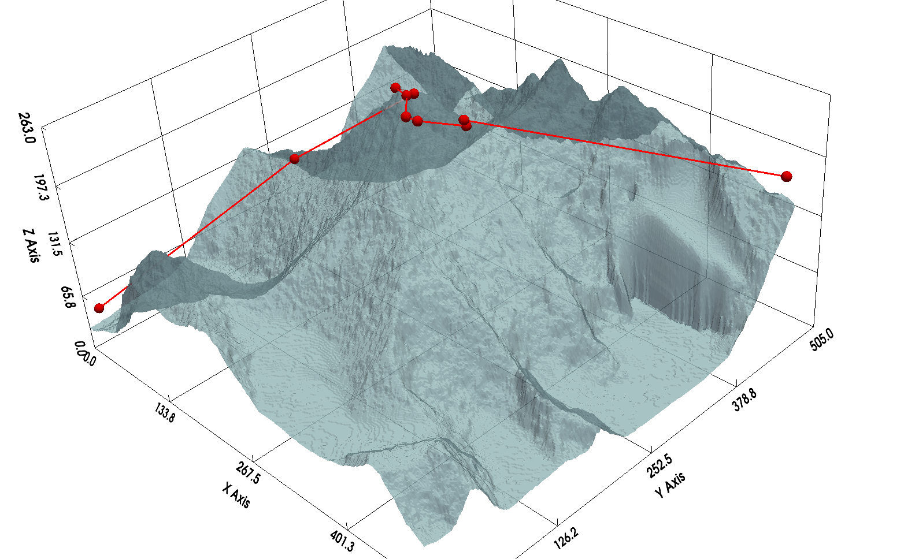
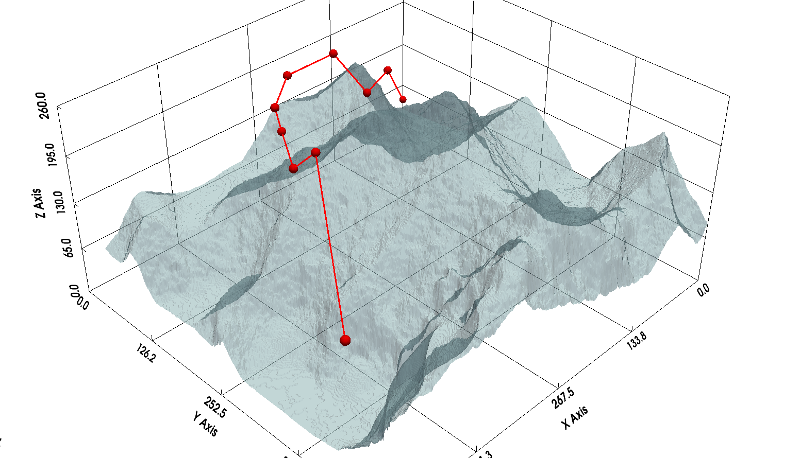
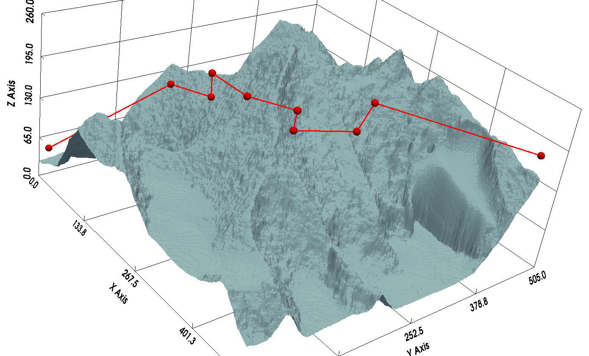
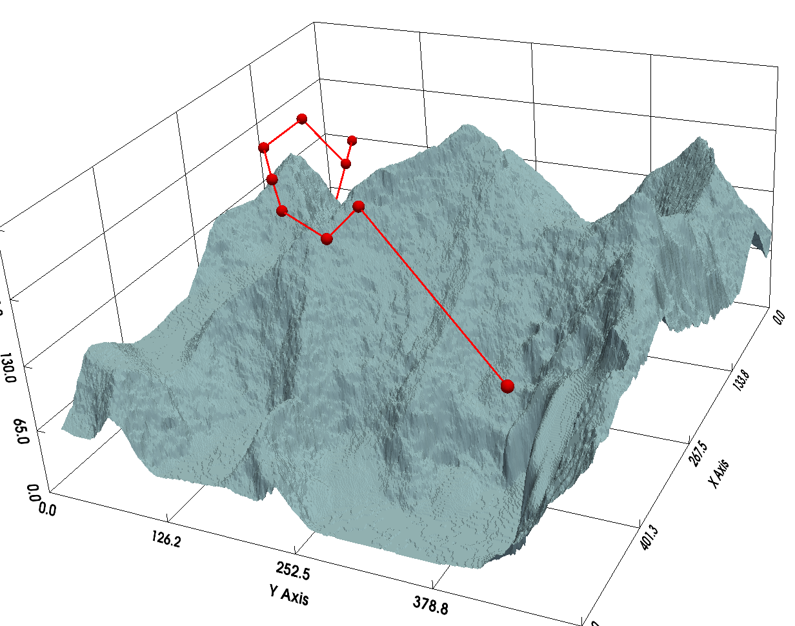
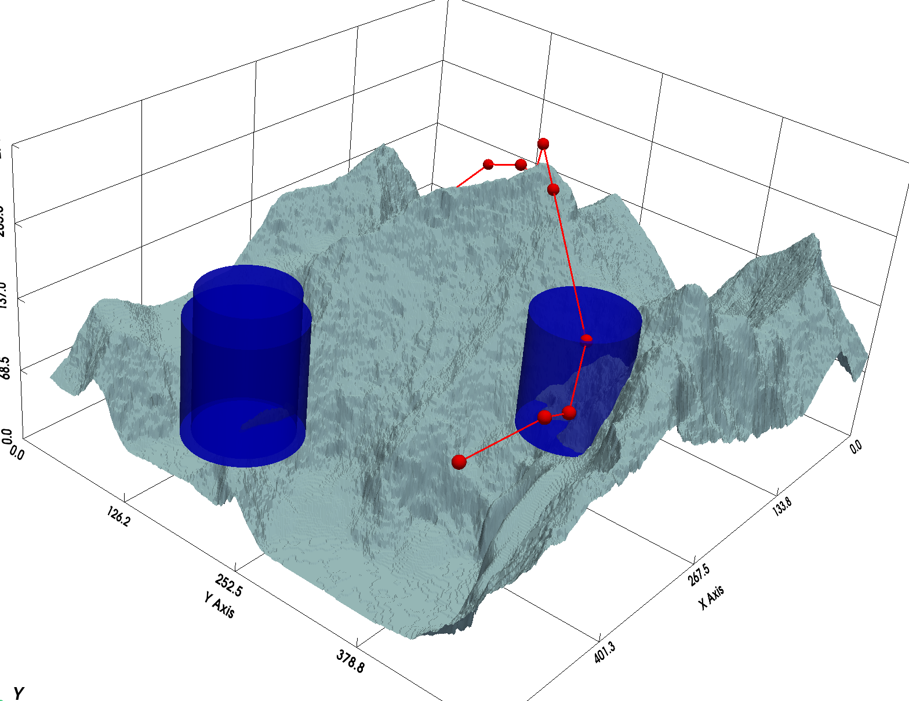
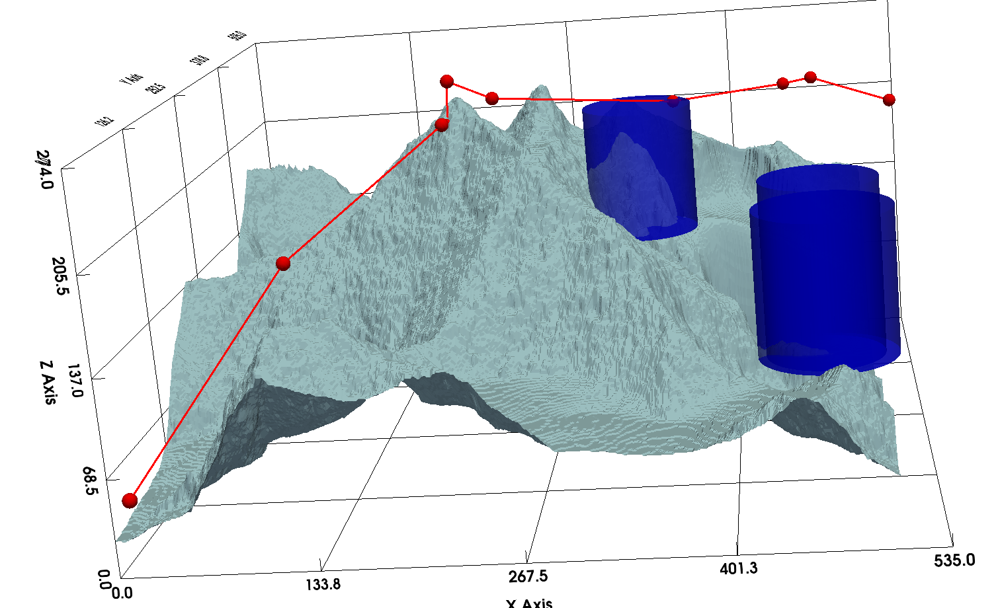
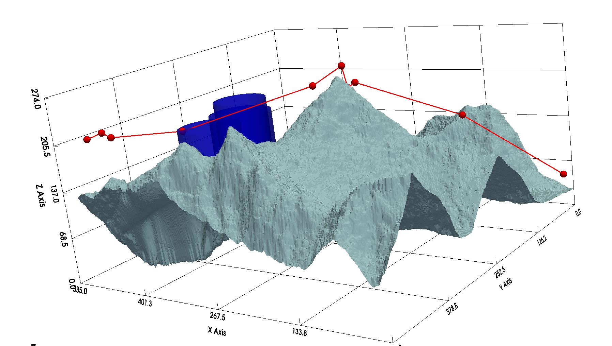
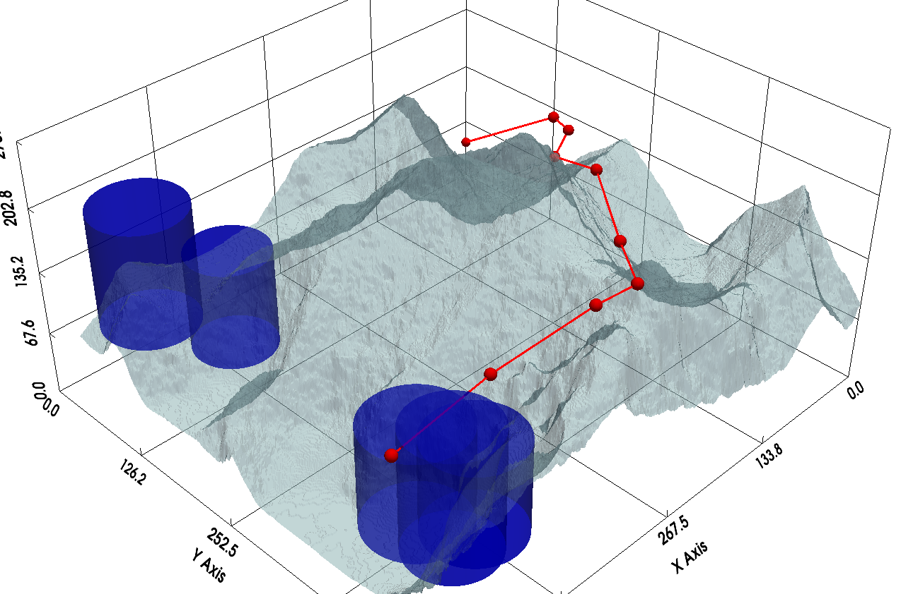
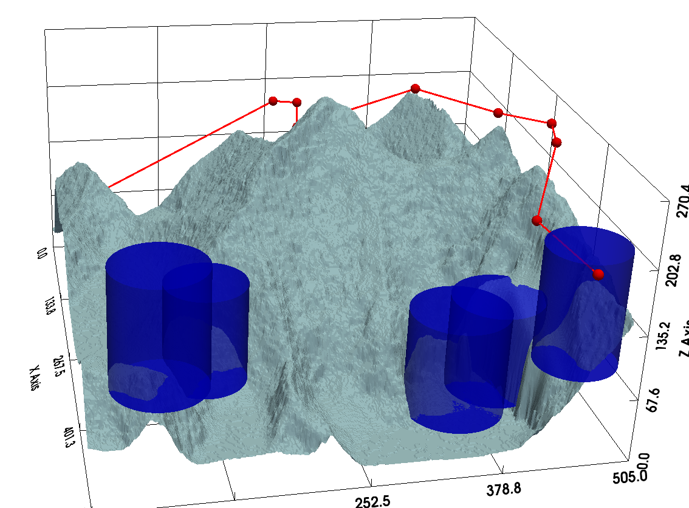
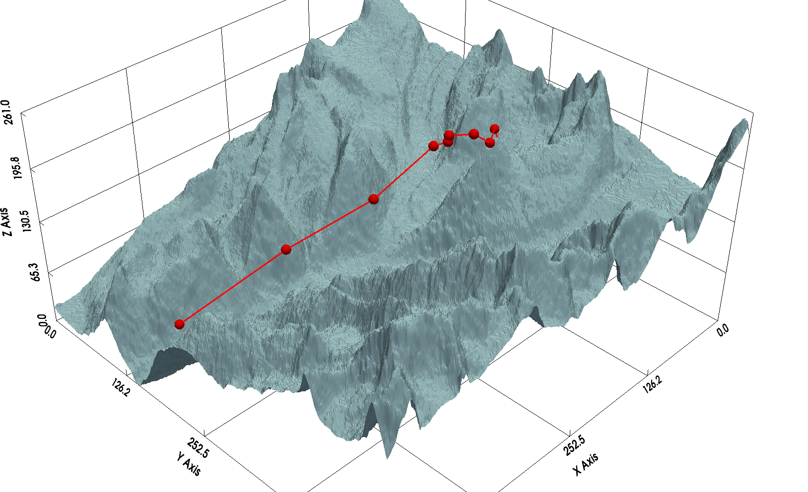

Old Version

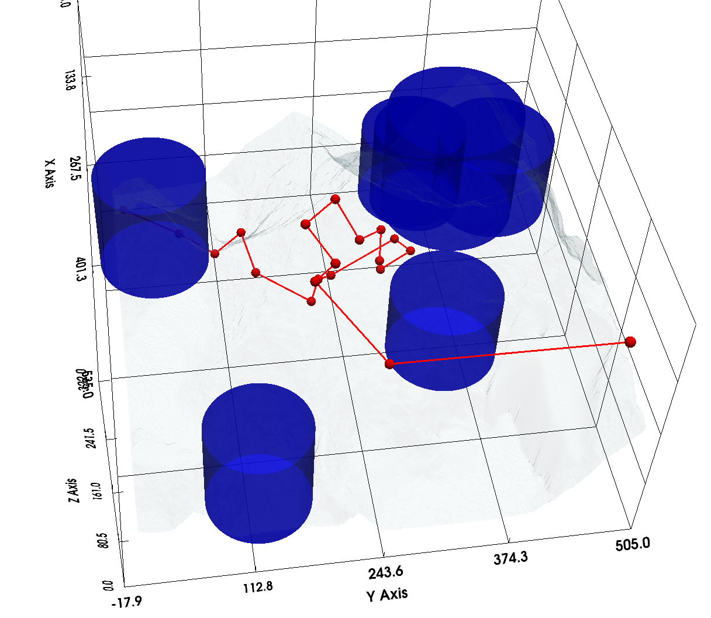
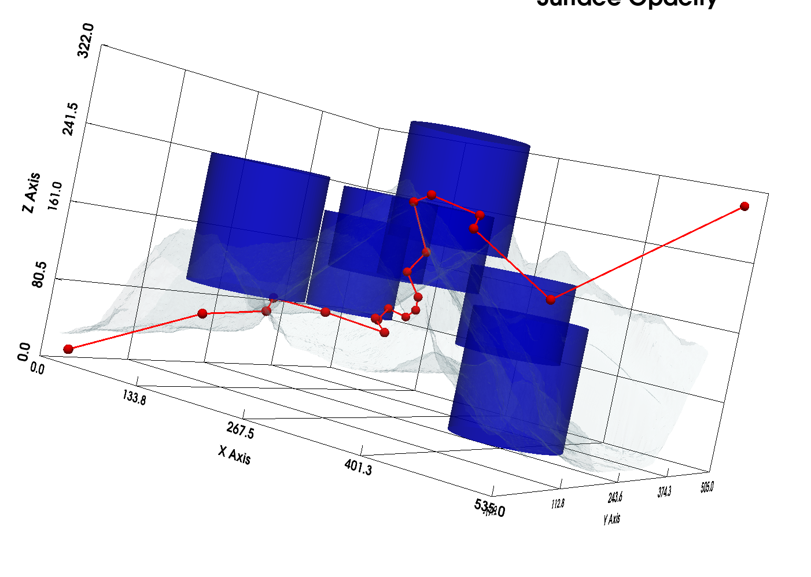