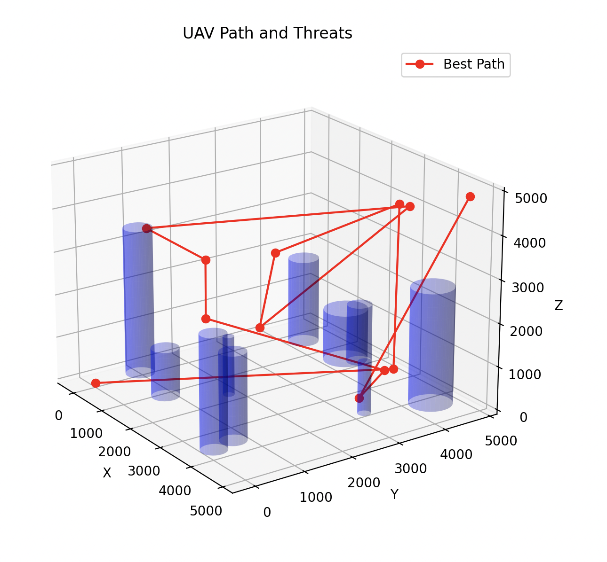

RP Implementation #3

Implemented the research paper titled "Path planning for unmanned aerial vehicles in complex environment based on an improved continuous ant colony optimisation."

Oh boy this one was a hard one. I think I spent 8 hours trying to figure this out. I definetly realised that I should not be relying on ChatGPT at all because it slowsdown my understanding. I don't have time to thoroughly check, orptimize, or implement the bit elevation map feature. Maybe I will come back to this becuase it was quite interesting. In the end couldn't get it to work right now.

Here are some pictures:

